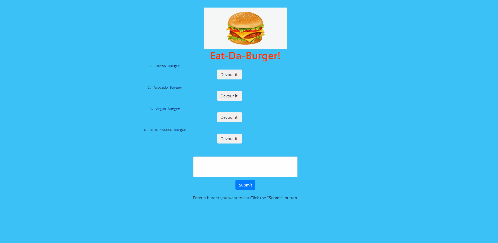

# Eat Da Burger!

### Table of Contents:
* [Description](##-Description)
* [Installation](##-Installation)
* [Demonstration](##-Demonstration)
* [Credits](##-Credits)
* [License](##-License)

## Description
This app lets you have fun while trying to devour a burger. Using simple express-handlebars and mysql to handle database information. You can simply create a burger and devour it. 

## Installation
For this program you will need to install three packages. To install you will need to be in your terminal or bash and run the commands:

* *npm i express*
* *npm i mysql*
* *npm i express-handlebars*

After that you will run the command *node server.js* 

## Demonstration

## Credits

* [Express](https://www.npmjs.com/package/express)
* [MySQL](https://www.npmjs.com/package/mysql)
* [Express-handlebars](https://www.npmjs.com/package/express-handlebars)

## License

This project is licensed by MIT